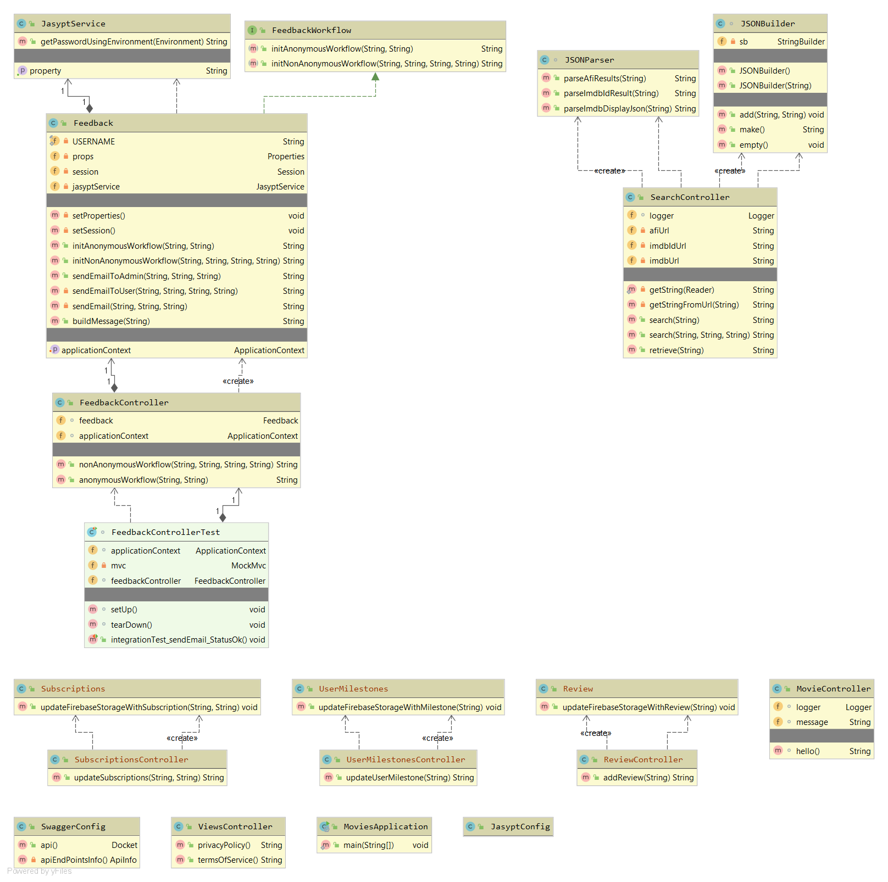

# movies-simplyatx
Movie and TV show info aggregation website.

  &nbsp;&nbsp;

## Front-end static and Firebase

### Dependencies
Node.js and NPM:
https://nodejs.org/en/   
Firebase CLI (fetch via npm):
https://firebase.google.com/docs/cli#install-cli-windows
    
### Build the front-end
From root dir    
`cd funcitons`    
`npm install`

This will generate the node_modules and install dependencies (e.g., eslint)
Ensure you have a `.gitignore` file with node_modules included inside

### Deploy the front-end
To deploy the full client-side app:    
`firebase deploy`   
To deploy only functions:    
`firebase deploy --only functions`    
To deploy everything except functions:    
`firebase deploy --only hosting`    

### Reference Documentation
For further reference, please consider the following sections:

* [Firebase Documentation](https://firebase.google.com/docs)
* [Firebase Hosting](https://firebase.google.com/docs/hosting)
* [Firebase Hosting with Cloud Run (Dynamic Content)](https://firebase.google.com/docs/hosting)
* [Firebase CLI Reference](https://firebase.google.com/docs/cli/)

## Back-end API

### Dependencies
To build:
- Maven 3.3.9
- JDK 1.8.0_121
To deploy: 
- Google Cloud CLI

### Technology Stack
Component of a microservice architecture, developed with a `Mobile First` approach. 

REST API: Spring Boot 2.2.1.RELEASE
Templating Engine: Thymeleaf
Java testing: JUnit 5 Jupiter
Client-side: JQuery 3.4.1
UI: Bootstrap 4.3.1 

### Build the back-end
In the main project directory, where `pom.xml` resides, execute:
`mvn clean package`
Maven will build the project and generate a `target` directory, which will contain the project JAR package.
To build and skip unit tests, execute:
`mvn clean package -DskipTests`

### Run the back-end

With the back-end built and `target` directory with JAR present, open a CMD window. 
 
Execute: `java -jar movies-*.jar`

Open a browser and navigate to:
`localhost:8080/graphs`

### Viewing the API
To view the available API endpoints and details about them:
1. Ensure the project is running and you can navigate to `localhost:8080`
2. Navigate to: 
http://localhost:8080/swagger-ui.html

    

### Deploy the back-end

1. Build Docker image:
`gcloud builds submit --tag gcr.io/movies-simplyatx/movies`
2. Deploy the image:
`gcloud beta run deploy --image gcr.io/movies-simplyatx/movies`
    - Select [1] Cloud Run (fully managed) for the target platform
    - Select [6] us-central1 for the region
    - Press `Enter` to select the default for service name (movies)

### Jasypt Encryption

### Class diagram

### Reference Documentation
For further reference, please consider the following sections:

* [Official Apache Maven documentation](https://maven.apache.org/guides/index.html)
* [Spring Boot Maven Plugin Reference Guide](https://docs.spring.io/spring-boot/docs/2.2.1.RELEASE/maven-plugin/)
* [Spring Web](https://docs.spring.io/spring-boot/docs/2.2.1.RELEASE/reference/htmlsingle/#boot-features-developing-web-applications)

### Guides
The following guides illustrate how to use some features concretely:

* [Building a RESTful Web Service](https://spring.io/guides/gs/rest-service/)
* [Serving Web Content with Spring MVC](https://spring.io/guides/gs/serving-web-content/)
* [Building REST services with Spring](https://spring.io/guides/tutorials/bookmarks/)

### Debug Information
Debug is turned on by default. Press `Ctr+Shft+I` or `F12` on some browsers to view the console.
Running the application locally will also display details in the console. 